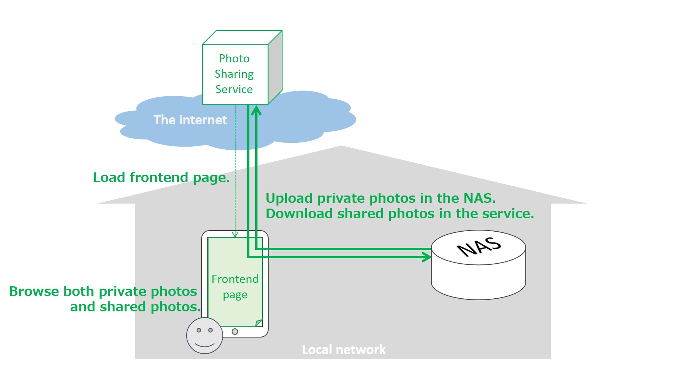
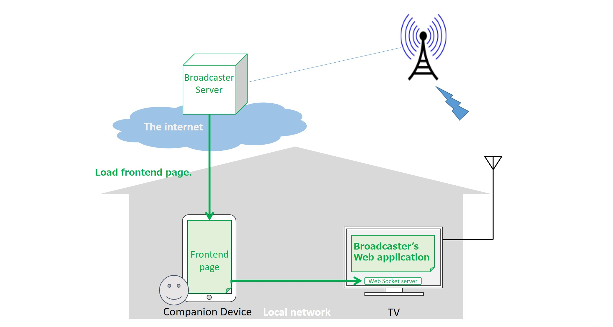

# Use Cases of HTTPS/WSS in Local Network

This document describes use cases where browsers communicate with web-server-capable devices in local network via HTTP and/or WebSocket over TLS.
These use cases are intended to clarify requirements in terms of network (topology, protocol, etc.) and security
(privacy concern, issuing a certificate, validation, etc.).

## UC-01: Photo sharing between online services and home NAS devices

A user usually stores her private photos and videos in a home NAS device.
She opens an online photo sharing service in a browser on her smartphone.
The online service finds her home NAS device through the browser and shows her the NAS via a popup window.
She selects the NAS and the browser shows her private photos in the NAS as well as the ones already stored in the online service.
She then selects and posts some photos that she would like to share with her friends or,
if she usually posts photos to the online service from her smartphone directly, she downloads the photos and posts them to the NAS device.

## UC-02: Video streaming with cache storage in local network

A user has a video cache server appliance in her home for enjoying high-quality (e.g. 4K) online video streaming services.
She enters an online video streaming service by using a browser on her TV.
The streaming service finds her cache server appliance through the browser and shows her the appliance via a popup window.
She selects the appliance and allows the service to use it as cache storage for high-quality video streaming.
After her approval, the service can cache 4K movies purchased by her (or put into her watch-list, etc.) in the appliance.
The video caching can be done by the frontend of the service loaded on the browser or by the appliance itself.
When she wants to watch one of the movies cached in the appliance, the online service fetch the movie from the appliance directly.
She can watch the movie comfortably (e.g. without causing stalls) regardless of the condition of the internet.

## UC-03: Web-based UI for home appliances (input/output constrained devices)

A user controls home appliances (e.g. air conditioner, microwave oven, refrigerator) with an online GUI service on the internet.
The home appliances are designed natively to be used via the online GUI loaded in a browser on her smartphone or tablet.
As with the use cases mentioned above, when she signs in to the online service, the service finds a home appliance through the browser.
Under her approval, the service can be granted access privileges for the appliance and she can control it through the GUI service.

## UC-04: Embedded system monitoring and controlling for display-capable devices

A field engineer of a digital signage service provider sets up an internet-capable display device.
The engineer makes the device display a specific website as a signage content by using a browser on the device.
After that, the website is monitoring the status of the embedded system (e.g. collecting logs, monitoring system resource utilization)
continuously via the browser by using internal REST APIs provided by an internal web server (e.g. https://localhost) of the device.
If the device provides the website with reboot functionality as one of the REST APIs, the service provider is able to not only check
the health of the device, if necessary, but also reboot the device remotely via the website. This use case is about Network based API described in [NetworkedBasedAPI.md](NetworkBasedAPI.md)

## UC-05: Data analysis from analytical and measuring instruments in local network

An analytical and measuring instrument in local network outputs a large amount of raw data as the result of an experiment.
An experimenter (a user of the instrument) signs in to a web-based analytical service provided by the vender of the instrument by using a browser in her PC.
The experimenter analyzes the raw data by using the web service and the service fetches the raw data from the instrument directly in local network.

## UC-06: Secure offline communication for home automation

A user sets up a home automation gateway is under normal circumstances using HTTPS to securely accept commands via a remote server.
In some cases the gateways internet connection is interrupted but local communication between a wall mounted control surface, app, or similar should stil be given.
This becomes very important when we consider that devices that can be controlled this way include door locks and security cameras.

## UC-07: Companion Device for Broadcast Interactive Service

A user is watching a broadcast interactive service which is enhanced by a broadcaster’s web app running on the user agent of TV. The user hands a companion device, e.g.  Smartphone, and launches a user agent with the Frontend page from the broadcaster web server. The Frontend page discovers the user-agent of TV and securely communicates with the broadcaster’s web application via the Web Socket Server on TV in order to provide GUI for the interactive broadcast service. Note that this use case is similar to the 2-UA of the Presentation API but the difference is that the broadcaster’s web application on TV is running on UA of TV in advance.

## UC-08: Presenting with Projector at office

A user is attending a meeting at office (outside home). The user logs on an online document sharing service on PC and present his document file on the service with the Projector connected via local network. FrontEnd page on UA1 at PC initiates to launch 2nd frontend page on 2nd UA at the projector to let the 2nd frontend page present the document.  Note that this use case is similar to 2-UA of Presentation API but the communication between 2-UA should be secured to prevent the MITM attack in the local network and also the regular WebSocket API is used for the communication, e.g. file transfer.

